# IREC Rocketry Payload (2025-2026)

**Skills:** Systems Integration, Thermodynamics, Electromechanical Actuation, Fluid Mechanics

## Project Overview
This project focused on engineering a 3D-printed rocketry payload designed to maintain a biologically viable environment (< 42°C) for *Bacillus Subtilis* bacteria during a 10,000-foot apogee flight. My work advanced through the detailed design and rapid prototyping phases, focusing on integrating a complete fluid delivery system, active thermal management, and power distribution within an extremely constrained physical envelope.

## Electromechanical Architecture

  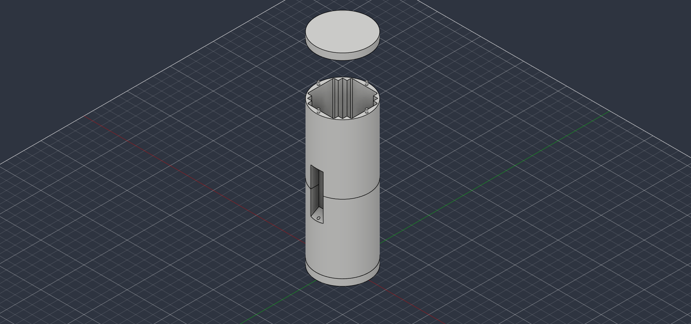
   
  <i>Figure 1: Isometric view of the external sabot housing modeled in Autodesk Fusion 360.</i>

 

  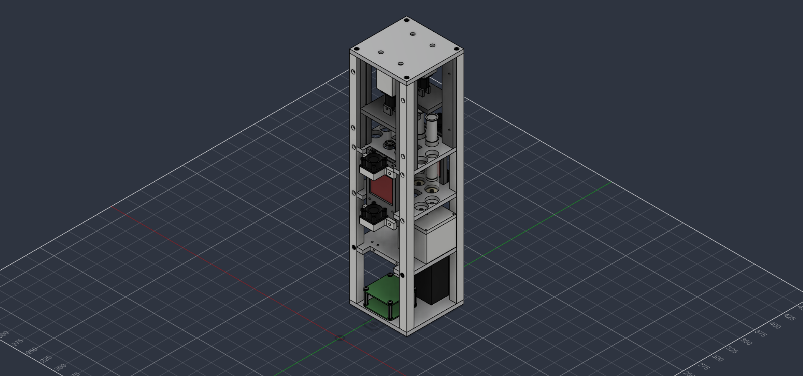
   
  <i>Figure 2: Internal multi-tiered electromechanical assembly highlighting component stacking and packaging.</i>

 

The payload was designed with a modular, tiered 4U CubeSat architecture to optimize space and simplify assembly within the strict diameter of the rocket airframe. Components were stacked vertically to minimize the footprint, securely housed within a custom-modeled sabot geometry.

## Actuation & Physics (Upper Compartment)

  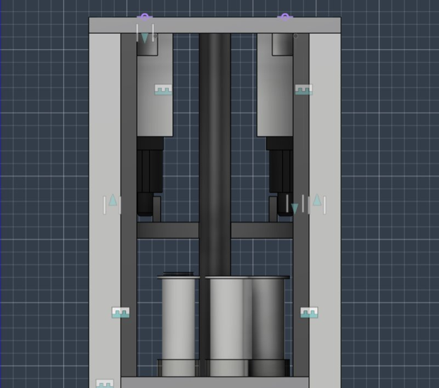
   
  <i>Figure 3: Upper compartment featuring the linear actuator mounts and unified interface plate.</i>

 

To perform the metabolic experiment, the payload requires a highly robust, high-torque fluid deployment system driven by linear actuators. 
- **Eliminating Off-Axis Torque:** The dual linear actuators drive a custom unified interface plate. While physical fit-checking was prototyped using standard 3D printing filaments, the final flight model was specified for Polycarbonate-Carbon Fiber (PC-CF) to provide high impact resistance and thermal stability. This unified plate design distributes the normal force evenly, completely eliminating off-axis torque.
- **Friction Mitigation:** Specified two-part silicone-free syringes for the primary driving and metabolic receiving to minimize theoretical static friction and ensure smooth actuator translation.

## Fluidics & Active Cooling (Middle Compartment)

  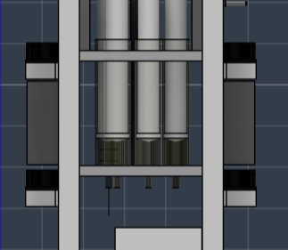
   
  <i>Figure 4: Middle compartment detailing the primary syringe bodies and aluminum cold block.</i>

 

The middle compartment is designed to house the core biological experiment and the primary thermal bridge.
- **Isobaric Fluid Expansion:** To guarantee a strict anaerobic (0% oxygen) environment, the fluidics architecture is designed around a syringe-to-syringe expansion method. The injection volume perfectly translates to the receiving volume ($\Delta V = 0$), relying on isobaric expansion ($P_1 V_1 = P_2 V_2$).
- **Conductive Thermal Bus:** The cold side of the Peltier system mounts directly to a custom aluminum "Cold Block," which interfaces physically with the syringes to maximize conductive thermal transfer to the fluid.

## Fluorometer Integration & Optical Detection

  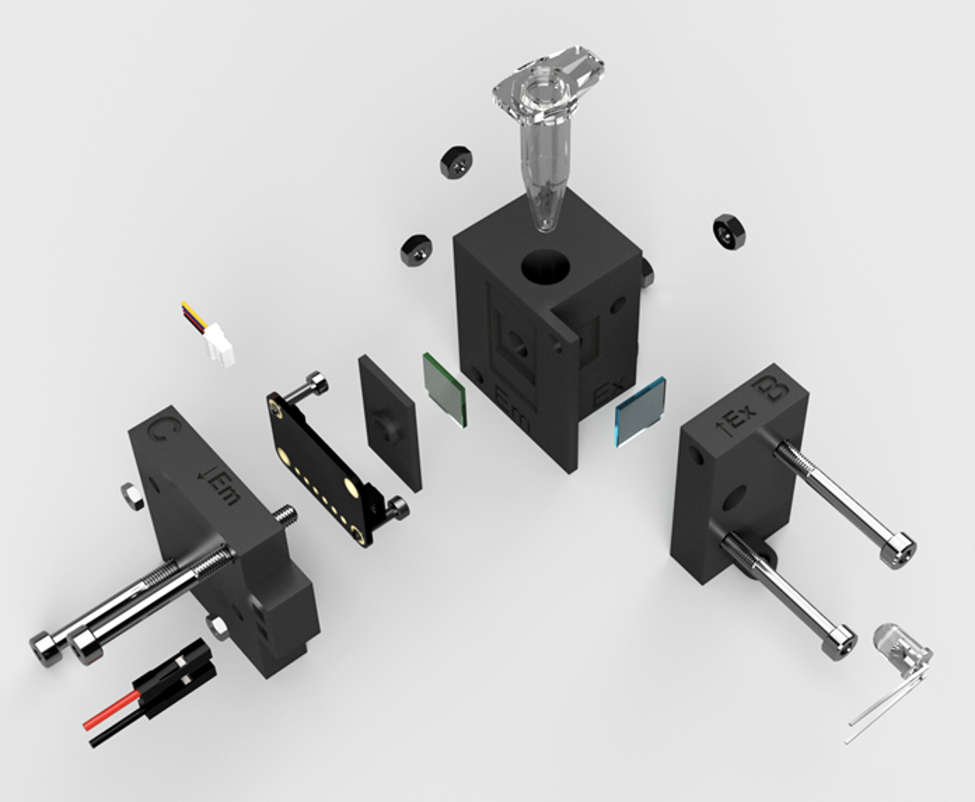
   
  <i>Figure 5: Baseline DIYNAFLUOR open-source architecture by Traulab.</i>

 

  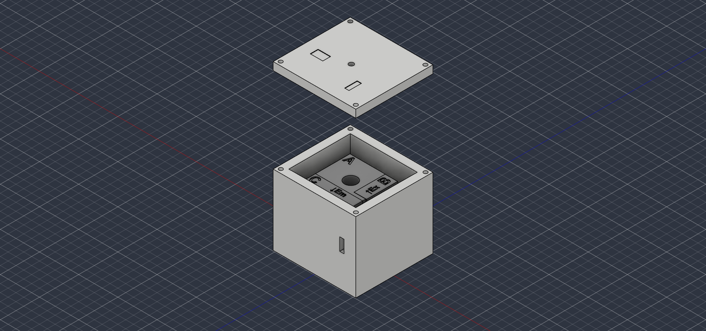
   
  <i>Figure 6: Baseline DIYNAFLUOR optical layout adapted into a custom ruggedized enclosure prototyped for fit-checking.</i>

 

The core scientific objective relied on a fluorometer to measure bacterial metabolic rates. Rather than reinventing the optical detection principles, I leveraged the open-source **traulab/DIYNAFLUOR** project as a baseline architecture. 

- **Ruggedized Enclosure Design:** I designed a custom, thick-walled housing in Fusion 360 to adapt this lab-bench device for rocket flight. I leveraged rapid 3D printing to conduct physical fit-checks of the custom sensor enclosures and verify tolerances for the internal structural frame.
- **Mechanical Immobilization:** The internal cavity was tolerance-fit to the optical block, while the lid utilized a four-point screw mount to ensure intense launch vibrations would not shift the focal point.

## Thermal Exhaust & Shielding (Sabot)

  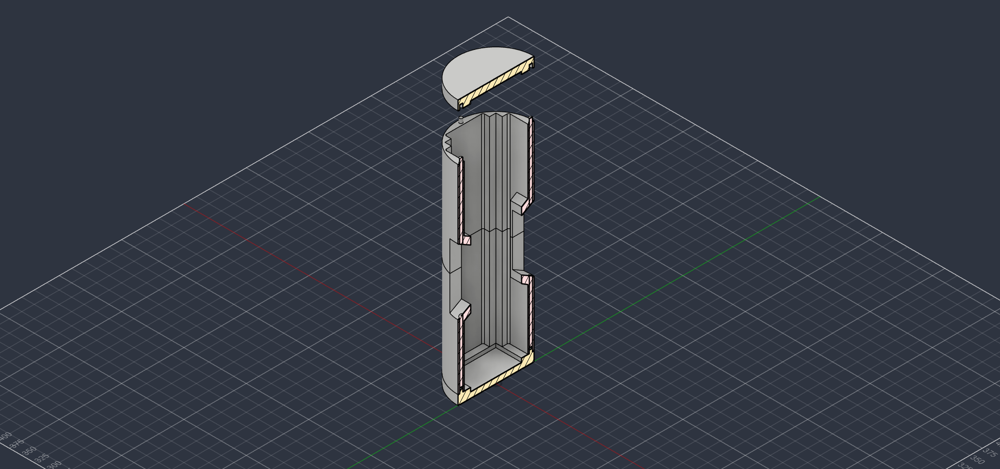
   
  <i>Figure 7: Sabot cross-section showing insulation recesses and forced convection corridors.</i>

 

Aerodynamic heating at high velocities necessitated an active cooling loop and strategic insulation strategy.
- **Forced Convection Exhaust:** The thermal exhaust strategy specifies dual fans to drive forced convection ($Q = hA\Delta T$) across a finned heatsink. This heat is actively vented out of the airframe through targeted exhaust holes.
- **Aerodynamic Shielding:** The sabot housing features rectangular wall recesses designed to hold high R-value insulation to passively combat aerodynamic heating.

## Avionics Packaging & Integration (Lower Compartment)

  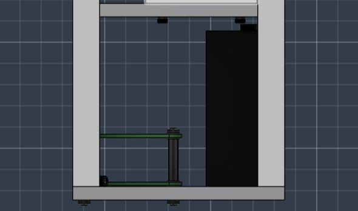
   
  <i>Figure 8: Lower compartment housing the high-mass battery arrays for CG optimization.</i>

 

The physical arrangement of the control electronics and power systems is dictated by rocket flight dynamics and safety constraints.
- **Z-Axis CG Optimization:** The high-mass NiMH battery arrays are deliberately placed at the lowest possible Z-axis coordinate. This design lowers the Center of Gravity (CG) to dynamically stabilize the payload within the airframe.
- **Physical Avionics Isolation:** The lower electronics compartment is physically walled off from the middle fluidics compartment to protect the microcontrollers from potential leaks or aerosolized biological media.

  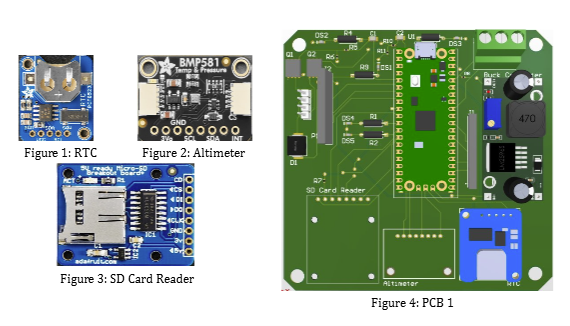
   
  <i>Figure 9: Custom primary PCB handling telemetry, RTC, altimeter, and power distribution.</i>

 

  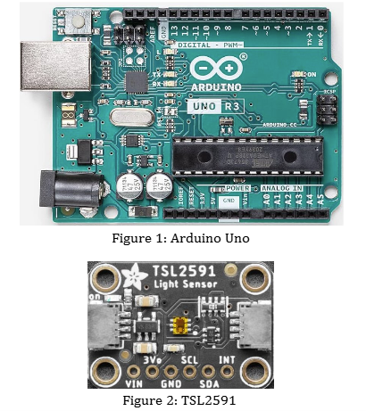
   
  <i>Figure 10: Dedicated Arduino Uno and TSL2591 light sensor for fluorometer operations.</i>

 

  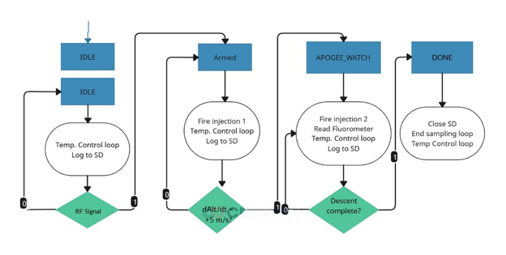
   
  <i>Figure 11: Distributed control system logic flow for temperature regulation and fluid injection.</i>

 

- **Distributed Control Systems:** The architecture splits processing between two distinct boards. The primary PCB handles the Raspberry Pi Pico, real-time clock (RTC), altimeter, and actuator/fan power distribution. A secondary Arduino Uno board is dedicated strictly to the continuous TSL2591 light sensor readings. 
- **Packaging Constraints:** Integrating standard breakout boards and the Arduino footprint required careful standoff placement and wire routing within the lower sabot to ensure reliable connections without interfering with the battery mass.
